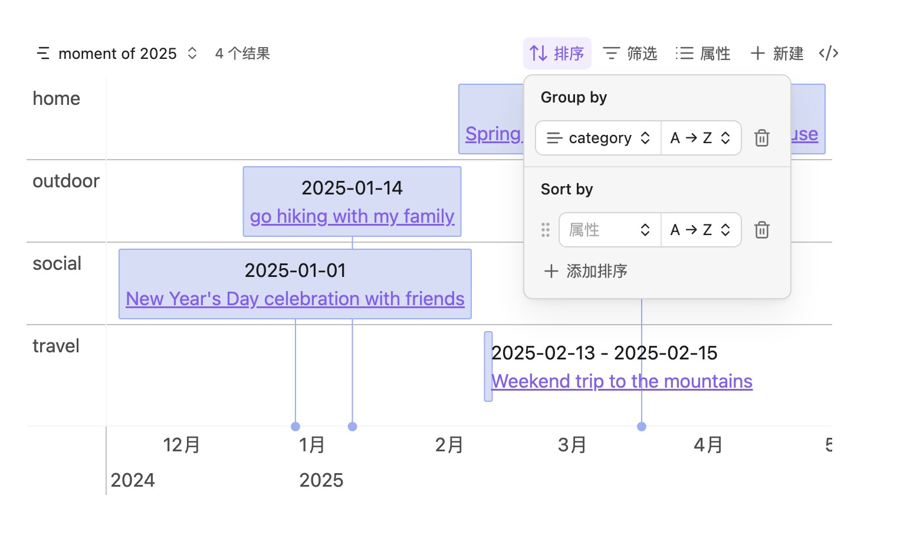

# obsidian-bases-timeline-view

timeline view for obsidian bases.

## Features

- **Custom Fields Support**: Define timeline items using custom fields in your notes. You can specify `start`, `end`, `content`, `startLabel`, and `endLabel` fields, or use Bases formulas to dynamically calculate these values. The plugin automatically falls back to default values (`note.start`, `note.end`, etc.) when custom fields are not specified.

- **Group Support**: Organize timeline items into groups using Bases' `group-by` functionality (requires Obsidian 1.10 or later). This allows you to categorize and visually separate timeline items based on any field in your notes, making it easier to view related events together.

## Example

### Basic Usage

to draw the timeline view, you need to add some properties to your obsidian file, for example:

```markdown
start: 2025-01-01
end: 2025-01-04
content: title of the item
tags: - moment
```

then you can use the bases and add a timeline view.

```base
filters:
  and:
    - file.tags.contains("moment")
    - and:
        - file.ctime >= "2025-01-01"
        - file.ctime <= "2025-12-31"
views:
  - type: timeline-view
    name: moment of 2025
```

and the result may be looked like this:


if you want to use the default properties, here is a quick look of the default properties:

Here is the explanation of the properties that we used:

| Property   | Description                         | Required | Example           | Remark                                |
| ---------- | ----------------------------------- | -------- | ----------------- | ------------------------------------- |
| start      | the start date of the item          | no       | 2025-01-01        |                                       |
| end        | the end date of the item            | no       | 2025-01-04        |                                       |
| content    | the content of the item             | no       | title of the item | if not set, it will use the file name |
| startLabel | custom label for display start date | no       | start             |                                       |
| endLabel   | custom label for display end date   | no       | end               |                                       |

### Custom Field

if you don't want to use the default properties, you can use the custom properties to define the timeline items. for example:

```base
filters:
  and:
    - file.tags.contains("moment")
    - and:
        - file.ctime >= "2025-01-01"
        - file.ctime <= "2025-12-31"
views:
  - type: timeline-view
    name: moment of 2025
    startField: note.startData
    endField: note.endEnd
```

Make sure that the properties you used are defined in your obsidian file.

### Group

if your Obsidian is 1.10 or later, you can use `group by` to group the timeline items. for example:


## Tips

- basically, `start` and `end` should be `Date` type, but if your `start` is something unusual, for example "2025" or "2025-01", you should use `String` type

## Installation

Three ways to install:

- Install from Obsidian Community Plugin（Not released yet）
- Manual install
  - Download the latest release from [GitHub Releases](https://github.com/xjiaxiang/obsidian-bases-timeline-view/releases)
  - Create a new folder named `bases-timeline-view` in your Obsidian plugins folder(`.obsidian/plugins/`)
  - Move the downloaded files to the new folder
  - Reload Obsidian
  - Enable the plugin in **Settings → Community plugins**
- Install from BRAT(Currently Recommended)
  - Install [BRAT](https://github.com/TfTHacker/obsidian42-brat) if you haven't installed it yet.
  - Enable BRAT in **Settings → Community plugins**
  - Open Command Palette(Ctrl+P) and type `BRAT: Plugins: Add a beta plugin for test` to open the Community Plugin Manager.
  - input the plugin repository url: https://github.com/xjiaxiang/obsidian-bases-timeline-view
  - select the latest version
  - click `Add plugin` button to install the plugin.
  - enable `bases-timeline-view` plugin in **Settings → Community plugins** if it's not enabled automatically.

## Others

- Thanks to [vis-timeline](https://github.com/visjs/vis-timeline) and [obsidian timeline](https://github.com/Darakah/obsidian-timelines)
