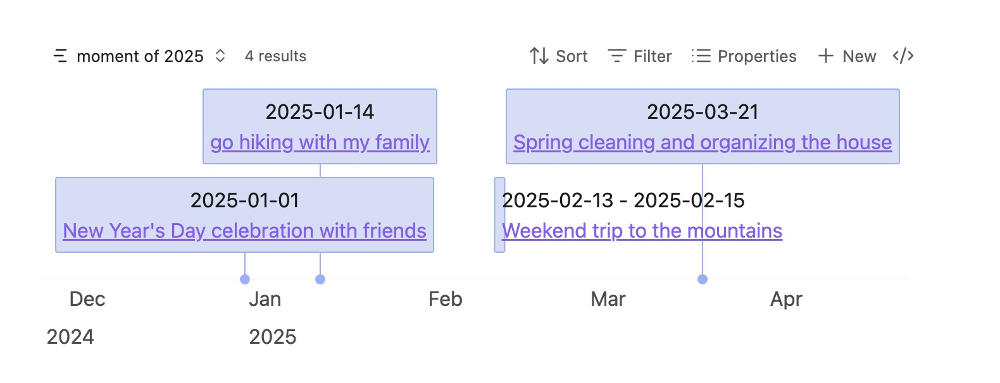

# obsidian-bases-timeline-view

timeline view for obsidian bases.



## Example

to draw the timeline view, you need to add some code to your obsidian file, for example:

```markdown
start: 2025-01-01
end: 2025-01-04
content: title of the item
```

then you can use the bases and add a timeline view.

Here is the explanation of the code that we supported:

| Property   | Description                         | Required | Example           | Remark                                |
| ---------- | ----------------------------------- | -------- | ----------------- | ------------------------------------- |
| start      | the start date of the item          | yes      | 2025-01-01        |                                       |
| end        | the end date of the item            | no       | 2025-01-04        |                                       |
| content    | the content of the item             | no       | title of the item | if not set, it will use the file name |
| startLabel | custom label for display start date | no       | start             |                                       |
| endLabel   | custom label for display end date   | no       | end               |                                       |

Tips:

- you can also define the code using bases formula.
- basically, `start` and `end` should be `Date` type, but if your `start` is something unusual, for example "2025" or "2025-01", you should use `String` type

## Installation

Two ways to install:

- Install from Obsidian Community Plugin
- Manual install
  - Download the latest release from [GitHub Releases](https://github.com/xjiaxiang/obsidian-bases-timeline-view/releases)
  - Unzip the release and copy the `bases-timeline-view` folder to your Obsidian plugins folder
  - Reload Obsidian

## Others

- Thanks to [vis-timeline](https://github.com/visjs/vis-timeline) and [obsidian timeline](https://github.com/Darakah/obsidian-timelines)
