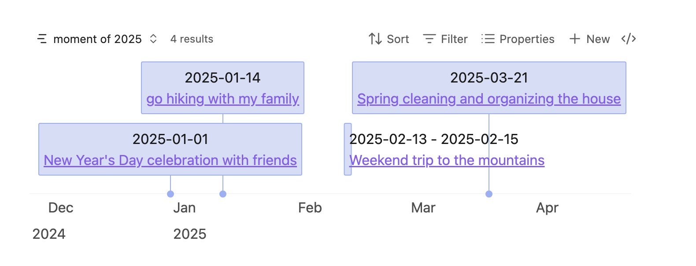
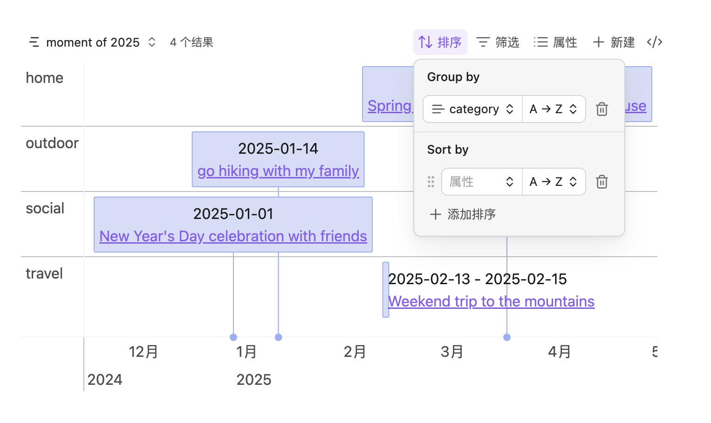

# obsidian-bases-timeline-view

Obsidian Bases 的时间线视图。

英文文档见仓库根目录 [README.md](../README.md)。

## 功能

- **自定义字段**：在笔记中用 `start`、`end`、`content`、`startLabel`、`endLabel` 等字段定义时间线条目，也可用 Bases 公式动态计算。未指定自定义字段时，会回退到默认值（如 `note.start`、`note.end` 等）。
- **分组**：使用 Bases 的 `group-by` 对时间线条目分组（需 Obsidian 1.10 或更高）。可按笔记任意字段分类并在视觉上分隔相关事件。
- **背景与标记（Bases）**：通过视图选项 `backgroundWhen` / `markerWhen`（通常为 Bases 公式）把匹配的笔记画成背景带或竖线标记，无需在笔记上写死角色。
- **渲染 API**：从 DataviewJS 或其他脚本调用 `plugin.api.render(...)`，分别传入 `items`、`backgrounds`、`markers` 即可绘制（不依赖 Bases 查询）。也可用 `plugin.api.dv.render(...)` 直接传入 Dataview 页面列表。

## 示例

### 基本用法

要绘制时间线，需要先在笔记中添加属性，例如：

```markdown
start: 2025-01-01
end: 2025-01-04
content: title of the item
tags:

- moment
```

然后创建 Bases，并添加时间线视图：

```base
filters:
  and:
    - file.tags.contains("moment")
    - and:
        - file.ctime >= "2025-01-01"
        - file.ctime <= "2025-12-31"
views:
  - type: timeline-view
    name: moment of 2025
```

效果大致如下：


默认属性说明：

| 属性       | 说明                     | 必填 | 示例              | 备注                                      |
| ---------- | ------------------------ | ---- | ----------------- | ----------------------------------------- |
| start      | 条目开始日期             | 否   | 2025-01-01        |                                           |
| date       | 条目开始日期             | 否   | 2025-01-01        | 未设置 start 时使用 date                  |
| end        | 条目结束日期             | 否   | 2025-01-04        |                                           |
| content    | 条目内容/标题            | 否   | title of the item | 未设置时使用文件名                        |
| startLabel | 开始日期的展示文案       | 否   | start             |                                           |
| endLabel   | 结束日期的展示文案       | 否   | end               |                                           |
| cssclasses | 挂到 vis 条目上的 CSS 类 | 否   | phase-bg          | Obsidian 内置 list 属性；多个类用空格拼接 |

### 自定义字段

若不想用默认属性名，可在视图中指定自定义属性，例如：

```base
filters:
  and:
    - file.tags.contains("moment")
    - and:
        - file.ctime >= "2025-01-01"
        - file.ctime <= "2025-12-31"
views:
  - type: timeline-view
    name: moment of 2025
    startField: note.startData
    endField: note.endData
```

请确保这些属性已在笔记中定义。

### 分组

Obsidian 1.10 及以上可使用 `group by` 对时间线条目分组，例如：


### 背景与标记（Bases）

Bases 视图只有一份查询结果。要在不给笔记写死角色的情况下画背景和标记：

1. 用**并集过滤**把事件、阶段、里程碑等都纳入结果。
2. 定义**公式**（或其他属性），描述「何时应画成背景 / 标记」。
3. 在时间线视图中，将 **background when** / **marker when** 指向这些属性。

角色由当前视图决定：同一篇笔记可以在某个视图里是普通条目，在另一个视图里是背景。两个选项都不配置时，所有匹配笔记都按普通条目绘制（与以前一致）。

同时命中时的优先级：**marker** > **background** > **item**。

- 背景笔记需要 `start` 和 `end`。
- 标记笔记需要 `start`（作为竖线时间）；`content` / 文件名作为标记标签。

```base
filters:
  or:
    - file.tags.contains("event")
    - file.tags.contains("phase")
    - file.tags.contains("milestone")
formulas:
  isPhase: 'file.tags.contains("phase")'
  isMilestone: 'file.tags.contains("milestone")'
views:
  - type: timeline-view
    name: Project overview
    backgroundWhen: formula.isPhase
    markerWhen: formula.isMilestone
```

### 自定义样式

#### CSS 类（`cssclasses`）

默认读取 Obsidian 内置的 `cssclasses`，并设置为 vis-timeline 条目/背景的 `className`。也可在视图中把 **class name field** 指向其他属性。

```markdown
cssclasses:

- phase-bg
```

```css
.vis-item.phase-bg {
	background-color: rgba(211, 211, 211, 0.45);
	border-color: #d3d3d3;
}
```

#### data 属性

时间线条目内部还会挂上 tags 与 frontmatter 的 `data-` 属性，可用 CSS 选择，例如：

```css
.vis-item:has(.timeline-item[data-tags~='#projects']) {
	border-width: 1px;
	border-style: solid;
}

.vis-item:has(
	.timeline-item[data-tags~='#projects'][data-status='not started']
) {
	background-color: rgba(211, 211, 211, 0.45);
	border-color: #d3d3d3;
}
```

- `#projects` 是标签，可换成任意 tag
- `data-status="not started"` 来自 frontmatter（status），可换成任意字段

## API

需要自行查询数据时（例如 DataviewJS），可分别传入 `items`、`backgrounds`、`markers`，从而绕开 Bases 视图「单次查询」的限制。

### 获取 API

插件 id：`bases-timeline-view`

```js
const api = app.plugins.plugins['bases-timeline-view']?.api;
if (!api) {
	// 插件未启用
}
```

### `api.render(containerEl, input, options?)`

| 参数          | 类型                      | 说明                                                              |
| ------------- | ------------------------- | ----------------------------------------------------------------- |
| `containerEl` | `HTMLElement`             | 挂载时间线的容器                                                  |
| `input`       | `TimelineRenderInput`     | 时间线数据（见下）                                                |
| `options`     | `TimelineOptions`（可选） | 额外的 [vis-timeline](https://github.com/visjs/vis-timeline) 选项 |

返回 vis-timeline 的 `Timeline` 实例。

重绘前请清空容器（DataviewJS 会频繁重跑）：

```js
this.container.empty();
api.render(this.container, input);
```

### 输入结构

```ts
type TimelineRenderInput = {
	items?: TimelineItemInput[];
	backgrounds?: TimelineBackgroundInput[];
	markers?: TimelineMarkerInput[];
	groups?: TimelineGroupInput[];
};
```

| 字段          | 作用                                                              |
| ------------- | ----------------------------------------------------------------- |
| `items`       | 普通事件（点 / 区间）                                             |
| `backgrounds` | 背景色带（`type: 'background'`）。不设 `group` 则为全宽背景       |
| `markers`     | 竖线自定义时间（`addCustomTime`）                                 |
| `groups`      | 泳道。若省略，会从 items/backgrounds 上使用过的 group id 自动收集 |

**Item**

| 字段                  | 必填 | 说明                                      |
| --------------------- | ---- | ----------------------------------------- | ------ | ----- |
| `start`               | 是   | `string                                   | number | Date` |
| `content`             | 是   | 纯文本或 HTML（例如带 `a.internal-link`） |
| `end`                 | 否   | 有则画成区间                              |
| `id`                  | 否   | 稳定 id（建议用笔记路径）                 |
| `group`               | 否   | 分组 id                                   |
| `className` / `title` | 否   | CSS 类 / 悬停标题                         |

**Background**

| 字段                                   | 必填 | 说明                                                    |
| -------------------------------------- | ---- | ------------------------------------------------------- |
| `start` / `end`                        | 是   | 区间                                                    |
| `content`                              | 否   | 标签 / 标识                                             |
| `id` / `group` / `className` / `style` | 否   | 含义同 item；`style` 例如 `background-color: rgba(...)` |

**Marker**

| 字段    | 必填 | 说明          |
| ------- | ---- | ------------- |
| `time`  | 是   | 标记时间      |
| `id`    | 否   | 自定义时间 id |
| `title` | 否   | 标记旁标签    |

**Group**

| 字段                  | 必填 | 说明     |
| --------------------- | ---- | -------- |
| `id`                  | 是   | 分组 id  |
| `content`             | 是   | 分组标签 |
| `className` / `order` | 否   |          |

### Dataview 快捷 API：`api.dv.render`

直接传入 Dataview 页面列表（三次查询，无需手写 map）。需要 [Dataview](https://github.com/blacksmithgu/obsidian-dataview)。

```js
api.dv.render(containerEl, {
  items?: pages,          // 普通事件（日期行 + 笔记链接 + data-*）
  backgrounds?: pages,    // 需要 start + end（纯文本标题）
  markers?: pages | { time, title?, id? }[],
  fields?: {
    start?: string,       // 默认：page.start，再试 page.date
    end?: string,         // 默认：end
    content?: string,     // 默认：content，再试 file.name
    className?: string,   // 默认：cssclasses
    group?: string,       // 可选页面属性；可被元素上的 group 覆盖
    startLabel?: string,  // 可选，开始日期展示文案
    endLabel?: string,    // 可选，结束日期展示文案
  },
  options?: TimelineOptions,
})
```

默认字段映射：

| 页面字段                              | 时间线字段                        |
| ------------------------------------- | --------------------------------- |
| `start`，否则 `date`                  | `start` / marker 的 `time`        |
| `end`                                 | `end`                             |
| `content`，否则 `file.name`           | item 链接标题 / marker 的 `title` |
| `cssclasses`（列表空格拼接）          | `className`                       |
| `file.path`                           | `id` + 链接目标                   |
| 可选 `fields.startLabel` / `endLabel` | 日期行展示文案                    |
| 可选 `fields.group`                   | 从该页面属性读泳道 id             |
| 元素自身的 `group`                    | 覆盖该条的 `fields.group`         |

`api.dv.render` 生成与 Bases 视图同款的 item HTML（日期行、`a.internal-link`、frontmatter/tags 的 `data-*`），并自动接线点击打开与 Page Preview 悬停。分组：元素上的 `group` 优先于 `fields.group`；同批只要有一条有 group，缺的会进 `Other`。

示例 — items / backgrounds 用不同字段分组：

```js
api.dv.render(this.container, {
	items: dv.pages('#event').map((p) => ({ ...p, group: p.dynasty })),
	backgrounds: dv.pages('#phase').map((p) => ({ ...p, group: p.area })),
	// 每条都手写了 group 时，可不设 fields.group
});
```

````markdown
```dataviewjs
const api = app.plugins.plugins['bases-timeline-view']?.api;
if (!api?.dv) {
  dv.paragraph('请先启用 Bases Timeline View 插件。');
  return;
}

this.container.empty();
this.container.style.height = '400px'; // Dataview 嵌入建议固定高度
api.dv.render(this.container, {
  items: dv.pages('#event'),
  backgrounds: dv.pages('#phase'),
  markers: dv.pages('#milestone'),
});
```
````

### 底层 DataviewJS 示例

需要完全自控时，自行 map 后调用 `api.render`：

````markdown
```dataviewjs
const api = app.plugins.plugins['bases-timeline-view']?.api;
if (!api) {
  dv.paragraph('请先启用 Bases Timeline View 插件。');
  return;
}

const items = dv.pages('#event')
  .where(p => p.start)
  .map(p => ({
    id: p.file.path,
    start: p.start,
    end: p.end,
    content: p.content ?? p.file.name,
    group: p.area,
  }));

const backgrounds = dv.pages('#phase')
  .where(p => p.start && p.end)
  .map(p => ({
    id: p.file.path,
    start: p.start,
    end: p.end,
    content: p.file.name,
    className: 'phase-bg',
  }));

const markers = [
  { id: 'launch', time: '2025-03-01', title: '发布' },
];

const groups = [...new Set(items.map(i => i.group).filter(Boolean))]
  .map(id => ({ id, content: String(id) }));

this.container.empty();
this.container.style.height = '400px'; // Dataview 嵌入建议固定高度
api.render(this.container, { items, backgrounds, markers, groups });
```
````

同一篇笔记可以在某个查询里当 `item`，在另一个查询里当 `background`——API 不会从 frontmatter 读取固定角色。

### 注意事项

- `api.render` 与 `api.dv.render` 会在容器上接线 Obsidian 链接点击（`openLinkText`）与 Page Preview（`hover-link`）。`api.dv` 的 item 已含 `a.internal-link`；`api.render` 仅在你传入的 `content` HTML 含这些链接时生效。
- 重绘时建议使用稳定的 `id`。DataviewJS 重跑前先 `container.empty()`。
- Dataview 嵌入建议设置固定的 `container.style.height`，减少布局 / redraw 问题。
- `options` 会透传给 vis-timeline；除非确实需要，否则少改默认选项。

## 提示

- Bases 视图与 `api` / `api.dv.render` 使用同一套日期归一化（字符串、`Date`、数字 → moment → `YYYY-MM-DD`）。
- `"2025"`、`"2025-01"` 这类不完整输入会被 moment 补全为完整日期（例如 `2025-01-01`）。若属性只需表示年/年月，可用 **文本** 类型，但绘制时仍会规范成 `YYYY-MM-DD`。

## 安装

三种方式：

- 从 Obsidian 社区插件安装（尚未上架）
- 手动安装
  - 从 [GitHub Releases](https://github.com/xiang2x/obsidian-bases-timeline-view/releases) 下载最新版本
  - 在插件目录（`.obsidian/plugins/`）下新建文件夹 `bases-timeline-view`
  - 将下载的文件放入该文件夹
  - 重新加载 Obsidian
  - 在 **设置 → 社区插件** 中启用
- 通过 BRAT 安装（当前推荐）
  - 若尚未安装，先安装 [BRAT](https://github.com/TfTHacker/obsidian42-brat)
  - 在 **设置 → 社区插件** 中启用 BRAT
  - 打开命令面板（Ctrl+P），输入 `BRAT: Plugins: Add a beta plugin for test`
  - 填写仓库地址：[https://github.com/xiang2x/obsidian-bases-timeline-view](https://github.com/xiang2x/obsidian-bases-timeline-view)
  - 选择最新版本
  - 点击 `Add plugin` 安装
  - 若未自动启用，在 **设置 → 社区插件** 中启用 `bases-timeline-view`

## 其他

- 感谢 [vis-timeline](https://github.com/visjs/vis-timeline) 与 [obsidian timeline](https://github.com/Darakah/obsidian-timelines)
