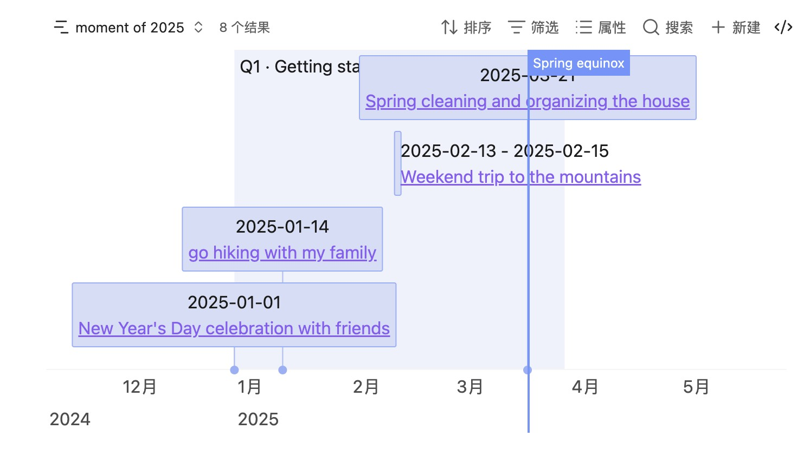
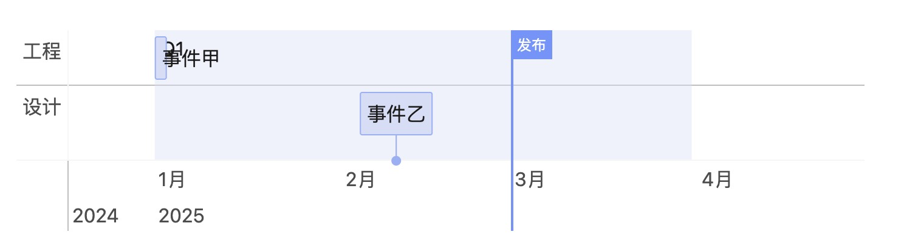

# obsidian-bases-timeline-view

Obsidian Bases 的时间线视图。

英文文档见仓库根目录 [README.md](../README.md)。

API 入参详见英文文档 [API reference](./api.md)。

## 功能

- **时间线**：按照时间线绘制笔记，从而直观的展示笔记的时间线信息。
- **分组**： 支持时间线条目分组，可按笔记任意字段分类并在视觉上分隔相关事件。
- **背景与标记（Bases）**：除了基础的时间线item外，还支持背景和marker的绘制。
- **渲染 API**：提供 API 供其他脚本调用，方便自定义绘制和扩展。
- **预览**: 时间线item支持Obsidian内置的预览功能，沉浸式查看相关内容。

## 示例

### 基本用法

要绘制时间线，需要先在笔记中添加属性，例如：

```markdown
start: 2025-01-01
end: 2025-01-04
content: title of the item
tags:

- moment
```

然后创建 Bases，并添加时间线视图：

```base
filters:
  and:
    - file.tags.contains("moment")
    - and:
        - file.ctime >= "2025-01-01"
        - file.ctime <= "2025-12-31"
views:
  - type: timeline-view
    name: moment of 2025
```

效果大致如下：


`timeline-view`会读取文件的frontmatter属性，并按照时间线绘制。
默认读取的文件frontmatter属性说明：

| 属性       | 说明                     | 必填 | 示例              | 备注                                      |
| ---------- | ------------------------ | ---- | ----------------- | ----------------------------------------- |
| start      | 开始日期                 | 否   | 2025-01-01        |                                           |
| date       | 开始日期                 | 否   | 2025-01-01        | 未设置 start 时使用 date                  |
| end        | 条目结束日期             | 否   | 2025-01-04        |                                           |
| content    | 条目内容/标题            | 否   | title of the item | 未设置时使用文件名                        |
| startLabel | 开始日期的展示文案       | 否   | start             |                                           |
| endLabel   | 结束日期的展示文案       | 否   | end               |                                           |
| cssclasses | 挂到 vis 条目上的 CSS 类 | 否   | phase-bg          | Obsidian 内置 list 属性；多个类用空格拼接 |

### 自定义字段

若不想用默认属性名，可在视图中指定自定义属性，例如：

```base
filters:
  and:
    - file.tags.contains("moment")
    - and:
        - file.ctime >= "2025-01-01"
        - file.ctime <= "2025-12-31"
views:
  - type: timeline-view
    name: moment of 2025
    startField: note.startData
    endField: note.endData
```

请确保这些属性已在笔记中定义。

### 分组

Obsidian 1.10 及以上可使用 `group by` 对时间线条目分组，例如：


### 背景与标记

通过设置`backgroundWhen`和`markerWhen`来指定哪些笔记应该绘制成背景或标记。以下是示例：

```base
filters:
  or:
    - file.tags.contains("moment")
    - file.tags.contains("phase")
    - file.tags.contains("milestone")
formulas:
  isPhase: 'file.tags.contains("phase")'
  isMilestone: 'file.tags.contains("milestone")'
views:
  - type: timeline-view
    name: moment of 2025
    startField: note.start
    endField: note.end
    backgroundWhen: formula.isPhase
    markerWhen: formula.isMilestone
```



> - background笔记的frontmatter需要 `start` 和 `end`。
> - marker笔记的frontmatter需要 `start`（作为竖线时间）；`content` / 文件名作为标记标签。
> - 同时命中时的优先级：**marker** > **background** > **item**。
> - background同样支持group特性，可以按group分组绘制。

### 自定义样式

利用Obsidian内置的样式扩展能力和时间线插件提供的扩展能力，可以自定义时间线的样式。

#### 通过 `cssclasses` 进行样式扩展

默认读取 Obsidian 内置的 `cssclasses`，并设置为 vis-timeline 条目/背景的 `className`。也可在视图中把 **class name field** 指向其他属性。

```markdown
cssclasses:

- phase-bg
```

```css
.vis-item.phase-bg {
	background-color: rgba(211, 211, 211, 0.45);
	border-color: #d3d3d3;
}
```

#### 通过 data 属性进行样式扩展

时间线条目内部还会挂上 tags 与 frontmatter 的 `data-` 属性，可用 CSS 选择，例如：

```css
.vis-item:has(.timeline-item[data-tags~='#projects']) {
	border-width: 1px;
	border-style: solid;
}

.vis-item:has(
	.timeline-item[data-tags~='#projects'][data-status='not started']
) {
	background-color: rgba(211, 211, 211, 0.45);
	border-color: #d3d3d3;
}
```

- `#projects` 是标签，可换成任意 tag
- `data-status="not started"` 来自 frontmatter（status），可换成任意字段

## API

需要自行查询数据时（例如 DataviewJS），使用插件暴露的 `api`：

| 方法                                       | 适用场景                                                     |
| ------------------------------------------ | ------------------------------------------------------------ |
| `api.render(containerEl, input, options?)` | 已整理好的通用数据结构，完全自控                             |
| `api.dv.render(containerEl, sources)`      | 直接传入 Dataview 页面列表，插件负责字段映射与默认 item 模板 |

插件 id：`bases-timeline-view`。

```js
const api = app.plugins.plugins['bases-timeline-view']?.api;
if (!api) {
	// 插件未启用
	dv.paragraph('请升级并启用 Bases Timeline View');
} else {
	// 调用 api.render / api.dv.render
}
```

**完整入参、类型见 [API reference](./api.md)。**

### 快速示例：`api.render`

````markdown
```dataviewjs
const api = app.plugins.plugins['bases-timeline-view']?.api;
if (!api) {
  dv.paragraph('请先启用 Bases Timeline View 插件。');
} else {
  const items = [
    {
      id: 'notes/事件-甲.md',
      start: '2025-01-01',
      end: '2025-01-03',
      content: '事件甲',
      group: '工程',
    },
    {
      id: 'notes/事件-乙.md',
      start: '2025-02-10',
      content: '事件乙',
      group: '设计',
    },
  ];

  const backgrounds = [
    {
      id: 'notes/Q1.md',
      start: '2025-01-01',
      end: '2025-03-31',
      content: 'Q1',
      className: 'phase-bg',
    },
  ];

  const markers = [
    { id: 'launch', time: '2025-03-01', title: '发布' },
  ];

  api.render(this.container, { items, backgrounds, markers });
}
```
````



### 快速示例：`api.dv.render`

````markdown
```dataviewjs
const api = app.plugins.plugins['bases-timeline-view']?.api;
if (!api?.dv) {
  dv.paragraph('请先启用 Bases Timeline View 插件。');
} else {
	api.dv.render(this.container, {
		items: dv.pages('#event'),
		backgrounds: dv.pages('#phase'),
		markers: dv.pages('#milestone'),
	});
}

```
````

### 命令

在 Markdown 编辑器中打开命令面板，运行：

- **Insert custom render template** — 在光标处插入 `api.render` 的 DataviewJS 示例
- **Insert Dataview render template** — 在光标处插入 `api.dv.render` 的 DataviewJS 示例

预览这些代码块需要安装 [Dataview](https://github.com/blacksmithgu/obsidian-dataview) 插件。插入内容为英文示例。

## 提示

- Bases 视图与 `api` / `api.dv.render` 使用同一套日期归一化（字符串、`Date`、数字 → moment → `YYYY-MM-DD`）。
- `"2025"`、`"2025-01"` 这类不完整输入会被 moment 补全为完整日期（例如 `2025-01-01`）。若属性只需表示年/年月，可用 **文本** 类型，但绘制时仍会规范成 `YYYY-MM-DD`。

## 安装

三种方式：

- (推荐)从 Obsidian 社区插件安装，搜索 `bases timeline view` 安装
- 手动安装
  - 从 [GitHub Releases](https://github.com/xjiaxiang/obsidian-bases-timeline-view/releases) 下载最新版本
  - 在插件目录（`.obsidian/plugins/`）下新建文件夹 `bases-timeline-view`
  - 将下载的文件放入该文件夹
  - 重新加载 Obsidian
  - 在 **设置 → 社区插件** 中启用
- 通过 BRAT 安装
  - 若尚未安装，先安装 [BRAT](https://github.com/TfTHacker/obsidian42-brat)
  - 在 **设置 → 社区插件** 中启用 BRAT
  - 打开命令面板（Ctrl+P），输入 `BRAT: Plugins: Add a beta plugin for test`
  - 填写仓库地址：[https://github.com/xjiaxiang/obsidian-bases-timeline-view](https://github.com/xjiaxiang/obsidian-bases-timeline-view)
  - 选择最新版本
  - 点击 `Add plugin` 安装
  - 若未自动启用，在 **设置 → 社区插件** 中启用 `bases-timeline-view`

## 其他

- 感谢 [vis-timeline](https://github.com/visjs/vis-timeline) 与 [obsidian timeline](https://github.com/Darakah/obsidian-timelines)
